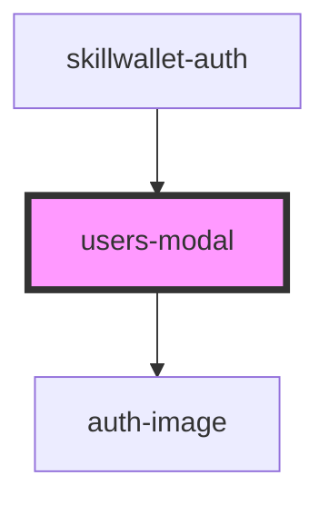

# skillwallet-auth

<!-- Auto Generated Below -->

## Events

| Event               | Description | Type               |
| ------------------- | ----------- | ------------------ |
| `closeModalOnLogin` |             | `CustomEvent<any>` |
| `showNewScreen`     |             | `CustomEvent<any>` |

## Dependencies

### Used by

 - [skillwallet-auth](.)

### Depends on

- [auth-image](.)

### Graph

----------------------------------------------

*Built with [StencilJS](https://stenciljs.com/)*
