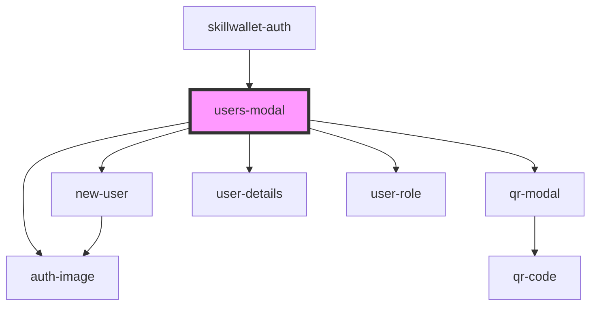

# skillwallet-auth

<!-- Auto Generated Below -->

## Events

| Event         | Description | Type                   |
| ------------- | ----------- | ---------------------- |
| `showNewUser` |             | `CustomEvent<Boolean>` |

## Dependencies

### Used by

 - [skillwallet-auth](.)

### Depends on

- [auth-image](.)
- [qr-modal](.)
- [new-user](.)
- [user-details](.)
- [user-role](.)

### Graph

----------------------------------------------

*Built with [StencilJS](https://stenciljs.com/)*
